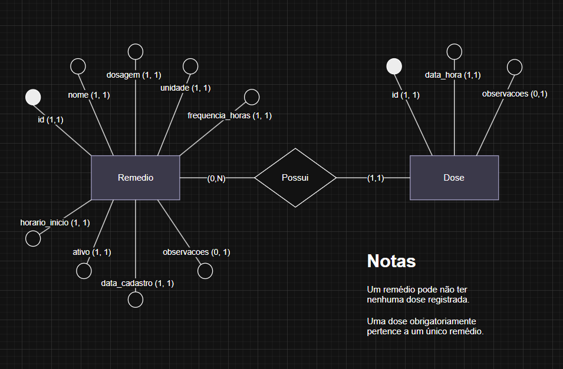

# Dose Certa API

API REST para controle de medicamentos de idosos. Permite cadastrar remédios com dosagens e frequências, registrar doses tomadas e acompanhar o histórico de aderência ao tratamento.

Desenvolvida com **Python**, **Flask** e **SQLite**.

---

## Requisitos

- Python 3.10 ou superior
- pip

---

## Instalação

### 1. Clone o repositório

```bash
git clone https://github.com/thiagow327/dose-certa-api.git
cd dose-certa-api
```

### 2. Crie o ambiente virtual

```bash
python -m venv venv
```

### 3. Ative o ambiente virtual

```bash
venv\Scripts\activate
```

### 4. Instale as dependências

```bash
pip install -r requirements.txt
```
---

## Inicialização
```bash
python app.py
```

---

## Documentação

Com a API rodando, acesse a documentação Swagger em:

```bash
http://localhost:5000/openapi/swagger
```

---

## Diagrama ER


